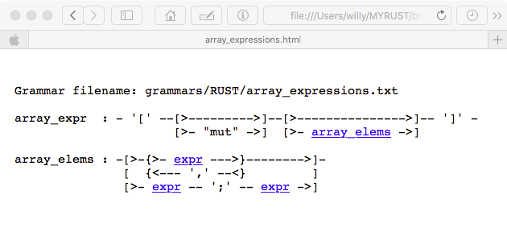
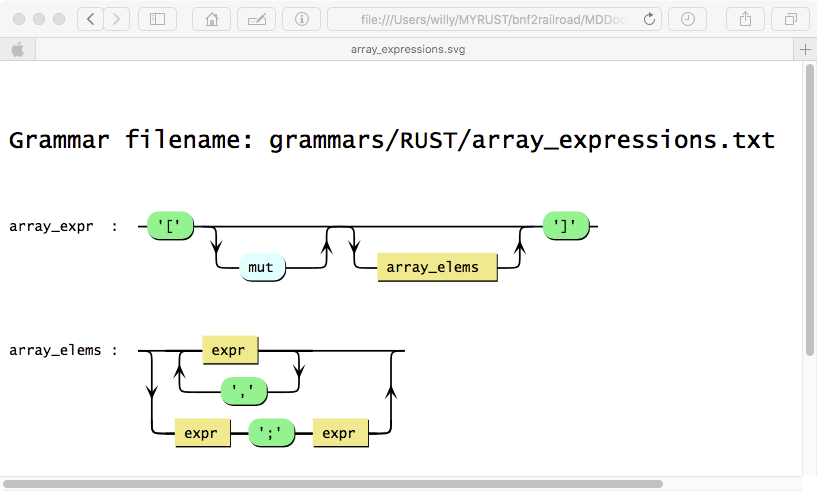
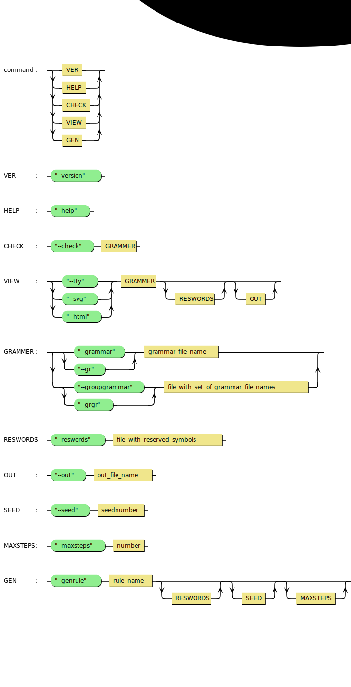

# Background
This project holds the RUST source for making the
console application `bnf2railroad` which will read grammars in EBNF-syntax and produce railroad views.

Why yet another tool?

Well, when programming in RUST, or just in any language, I also need to understand the grammar for the language. And I have found that the railroad view offer some complementary information.
The focus here is to get to know RUST but
at the moment there is no official grammar for RUST but I have used the one document in [RUST-Grammar](https://doc.rust-lang.org/grammar.html) 
# Audience
Anyone intrested in railroad style on grammars and people responsible for documentaion around grammars in general. Perhaps not for people writing grammars for compliers or...
# Overview
This tool can be used for  
1. Producing railroad views formatted as tty, html or svg of an EBNF grammar. 
2. Check a grammar regarding Undefined, Unused and Ambiguous definitions.
## Input
The program will accept grammars with the following syntax (mainly EBNF)
```
grammar        : rule + ;
rule           : IDENTIFIER ':' productionrule ';' ;
productionrule : sequence  , '|' ;
sequence       : ( item repeats ) + ;
item           : LITERAL ( '~' LITERAL ) ? 
                | ( IDENTIFIER ('-' IDENTIFIER ) ? )
                | '[' productionrule ']'
                | '(' productionrule ')' ;
repeats        : ( NUMBER  
                | ( '*' | '+' )  NUMBER ? 
                |  '?' 
                | ( ',' LITERAL )
                ) ?;
LITERAL        : 'a' ~ 'z' | 'A' ~ 'Z';
IDENTIFIER     : LITERAL ( LITERAL | NUMBER | '_')+ ;
NUMBER         : '1' ~ '9' ('0' ~ '9') + ;
```
Note: The ( ) or [ ] is for grouping  
Note: , LITERAL for specify list separators as a repeater  
Note: - for set difference  
Note: ~ for interval
## Output
Output is railroad diagrams as tty, html or avg style.  
When using `--check` you get an analyze of the grammar and also generate proper strings of the language with `--genrule`.
## Output Examples
Having a grammar in the EBNF as the source

array_expressions.txt

    array_expr  : '[' "mut" ? array_elems ? ']' ;
    array_elems : [ expr ,',' ] | [ expr ';' expr ] ;

and executing 

```sh
$ bnf2railroad --grammar array_expressions.txt
```
you get, as default output, a metal tty textfile as a railroad view like
## TTY Output
```
 array_expr  : - '[' --[>--------->]--[>--------------->]-- ']' -   
                       [>- "mut" ->]  [>- array_elems ->]           
                                                                    
 array_elems : -[>-{>- expr --->}-------->]-                        
                [  {<--- ',' --<}         ]                         
                [>- expr -- ';' -- expr ->]
```
This is a lightweight form where no web renderer is required or present.
Maybe other mark up signs would be preferred and that could be an option later on.

## HTML Output
There is also an HTML output form with hyperlinks.
```sh
$ bnf2railroad --grammar array_expressions.txt --html --out array_expressions.html
```
Drop the html file into a browser and you get



If you want to include one or more files of this kind (*.html) into an html document just search for `W3.JS.includeHTML` on how to do.

And then we have
## SVG Output
```sh
$ bnf2railroad --grammar array_expressions.txt --svg --out array_expressions.svg
```
Drop the svg file into a browser and you get



If you want to include one or more files of this kind (*.svg) into an html document use just ``.


## Check result
You can examine one or more file regarding Undefined, Unused and Ambiguous definitions

```sh
$ bnf2railroad --grammar array_expressions.txt --check
```

```
Undefined definitions:
 Symbol | Referenced in file(s)               |
 +--------------------------------------------+
 expr   | grammars/RUST/array_expressions.txt |

Unused definitions:
 Symbol     | Defined in file(s)                  |
 +------------------------------------------------+
 array_expr | grammars/RUST/array_expressions.txt |

Ambiguous  definitions:
 Symbol | Referenced in file(s) | Is defined in file(s) |
 +------------------------------------------------------+

```

## How to use

### Download and build
First of all you must download and build the RUST project.

## Usage or Usages Patterns or Use Cases
It's quite hard to make a good description of the unix command line arguments.
The approach for this tool is to write down switches and values as a grammar and then produce a railroad view of it.  
So the grammar is specified in `COMMANDS.txt` and looks like

```
command  : VER | HELP | CHECK | VIEW | GEN ;
VER      : "--version" ;
HELP     : "--help" ; 
CHECK    : "--check" GRAMMER; 
VIEW     : [ "--tty" | "--svg" | "--html"  ] GRAMMER RESWORDS? OUT? ;
GRAMMER  : [ ["--grammar" |  "--gr" ] grammar_file_name 
           | [ "--groupgrammar" | "--grgr" ] file_with_set_of_grammar_file_names ]  ;
RESWORDS : "--reswords" file_with_reserved_symbols ;
OUT      : [ "--out" out_file_name ] ;
SEED     : "--seed" seednumber ;
MAXSTEPS : "--maxsteps" number ;
GEN      : "--genrule" rule_name RESWORDS ?   SEED ? MAXSTEPS ?;
```

And by issue
```sh
$ bnf2railroad --grammar COMMANDS.txt
```
you get (and this content has actually been pasted in the source of the program)

```
command  : -[>- VER --->]-                                                               
             [>- HELP -->]                                                                
             [>- CHECK ->]                                                                
             [>- VIEW -->]                                                                
             [>- GEN --->]                                                                
                                                                                          
 VER      : - "--version" -                                                               
                                                                                          
 HELP     : - "--help" -                                                                  
                                                                                          
 CHECK    : - "--check" -- GRAMMER -                                                      
                                                                                          
 VIEW     : -[>- "--tty" -->]-- GRAMMER --[>------------>]--[>------->]-                  
             [>- "--svg" -->]             [>- RESWORDS ->]  [>- OUT ->]                   
             [>- "--html" ->]                                                             
                                                                                          
 GRAMMER  : -[>-[>- "--grammar" ->]-- grammar_file_name ------------------------>]-       
             [  [>- "--gr" ------>]                                              ]        
             [>-[>- "--groupgrammar" ->]-- file_with_set_of_grammar_file_names ->]        
                [>- "--grgr" --------->]                                                  
                                                                                          
 RESWORDS : - "--reswords" -- file_with_reserved_symbols -                                
                                                                                          
 OUT      : - "--out" -- out_file_name -                                                  
                                                                                          
 SEED     : - "--seed" -- seednumber -                                                    
                                                                                          
 MAXSTEPS : - "--maxsteps" -- number -                                                    
                                                                                          
 GEN      : - "--genrule" -- rule_name --[>------------>]--[>-------->]--[>------------>]-
                                         [>- RESWORDS ->]  [>- SEED ->]  [>- MAXSTEPS ->]  
```

Note the --groupgrammer or --grgr for multiple file input

Why not try an **svg** railroad view of this **Usage**

## Experiences
I have use this tool as follows:

1. Learning RUST
2. Understand ! RUST format 
3. Introvert to generate a better? traditional unix style view for --help etc 

## Input examples
There is a directory, `MDDocs`, on the distribution with different language grammars for
Json, Lua, Pascal, Smalltalk-80 and (incomplete) RUST.

